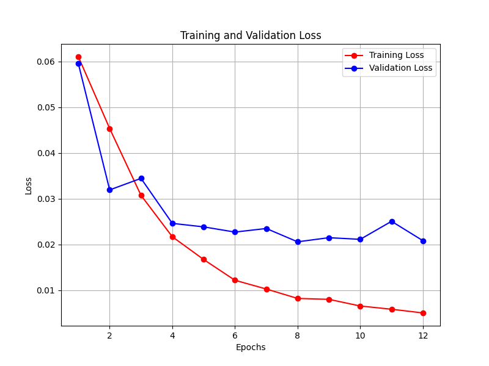
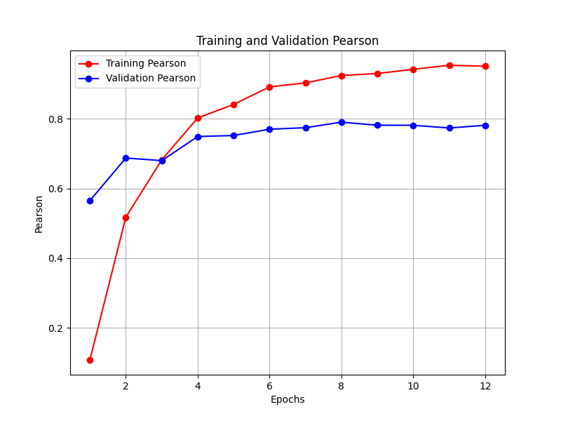
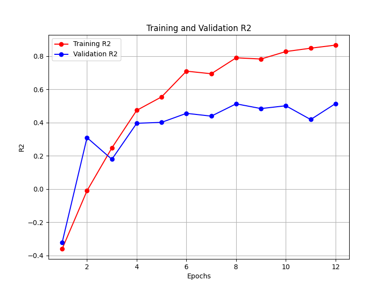

# Kaggle Competition Project

## Introduction

This repository contains the code and resources for the [U.S. Patent Phrase to Phrase Matching](https://www.kaggle.com/competitions/us-patent-phrase-to-phrase-matching/leaderboard).
The main goal of this competition is to rate, how similar pair of phrase is. 


## Installation and Hardware Requirements

Before you can run the code in this repository, you'll need to set up your environment and ensure you have
the necessary hardware resources.

### Environment Setup

1. Clone this repository:
   ```sh
   git clone https://github.com/OleksandrZhytnyk/kaggle-us-matching.git
   cd kaggle-competition
   ```
2. Create the new environment
  ```sh
     conda create -n us-matching python=3.9 anaconda

     conda activate us-matching

     pip install -r requirements.txt
```

3. Download the competition data to the __data__ folder:
```sh
├── data
│   ├── sample_submission.csv
│   ├── test.csv
│   ├── train.csv
│   ├── title.csv
```
Moreover, you need title.csv for this competition , this file you can download from [here](https://drive.google.com/file/d/1XPLvyMFcyjS61op_TCd_MiYjJd56ZPNh/view?usp=sharing).

### Hardware Requirements
To run the training scripts efficiently, it's recommended to have access to a machine with the following specifications:

* GPU with at least 12 GB 
* 40 GB RAM

## Model 

For the model in this competition we will use [microsoft/deberta-v3-large](https://huggingface.co/microsoft/deberta-v3-large) from Hugging Face.
With modification of calculation the embeddings, we use WeightedLayerPooling to achieves more results from extracting embedding.

```python
class WeightedLayerPooling(nn.Module):
    def __init__(self, num_hidden_layers, layer_start: int = 15, layer_weights=None):
        super(WeightedLayerPooling, self).__init__()
        self.layer_start = layer_start
        self.num_hidden_layers = num_hidden_layers
        self.layer_weights = layer_weights if layer_weights is not None \
            else nn.Parameter(
            torch.tensor([1] * (num_hidden_layers + 1 - layer_start), dtype=torch.float)
        )

    def forward(self, all_hidden_states):
        all_layer_embedding = all_hidden_states[self.layer_start:, :, :, :]
        weight_factor = self.layer_weights.unsqueeze(-1).unsqueeze(-1).unsqueeze(-1).expand(all_layer_embedding.size())
        weighted_average = (weight_factor * all_layer_embedding).sum(dim=0) / self.layer_weights.sum()
        return weighted_average
```

The full model looks like this 
```python
class DeBertav3Regressor(nn.Module):

    def __init__(self, model_path):
        super(DeBertav3Regressor, self).__init__()
        self.model_path = model_path
        self.deberta = AutoModel.from_pretrained(self.model_path, return_dict=True, output_attentions=False,
                                                 output_hidden_states=True)
        self.classifier = nn.Sequential(
            nn.Linear(1024, 1024),
            nn.Dropout(0.3),
            nn.GELU(),
            nn.Linear(1024, 1),
        )

    def forward(self, input_id, mask, device):
        pooler = self.deberta(input_ids=input_id, attention_mask=mask)
        all_hidden_states = torch.stack(pooler["hidden_states"])
        layer_start = 22
        pooler_text = WeightedLayerPooling(24, layer_start=layer_start, layer_weights=None).to(device)
        weighted_pooling_embeddings = pooler_text(all_hidden_states)
        weighted_pooling_embeddings = weighted_pooling_embeddings[:, 0]
        linear_output = self.classifier(weighted_pooling_embeddings)
        return linear_output
```

## Running the Training Script

In this section, we provide instructions on how to run the training script.

```sh
python train_deberta.py --train_path data/train.csv
                        --titles_path data/titles.csv
                        --model_name microsoft/deberta-v3-large
                        --batch_size 8
                        --max_length 100
                        --learning_rate 1e-5
                        --weight_decay 5e-5
                        --epochs 20
                        --save_dir ./checkpoints
                        --patience 4
                        --images_dir ./images
```
However, you can run this command without any hyperparameters , because it is default parameters to train the model.
Feel free to change hyperparameters.

After training, you will get the results in the __./images__ folder with all plots of training.
It is included the plot for Loss function, Pearson and R2 coef.

## Training Results
We present the results achieved during the training phase, including metrics, loss curves.







For the Early stopping we use validation Pearson. The best result that we can achieve is 0.797.

## Running Inference and Creating Submission
To generate predictions and create the submission file, follow this step:

```sh 
python inference_deberta --checkpoints checkpoints/checkpoint_epoch_8.pth
```

You should specify the path to the best model, to be able to make prediction.

After this command you will have in the root of the project __submission.csv__ file